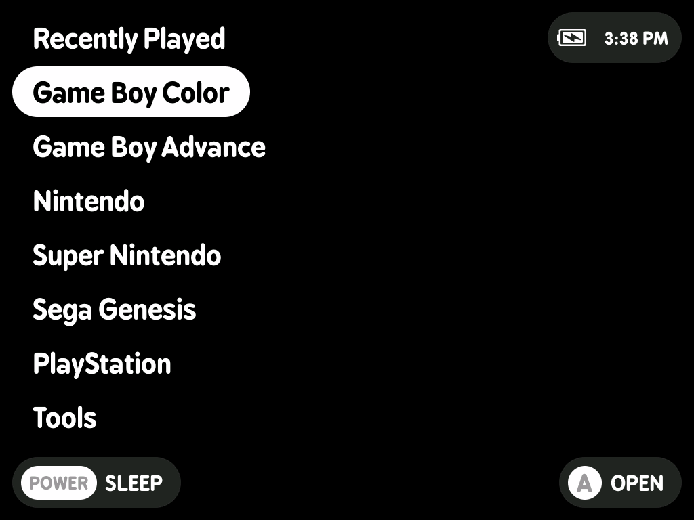
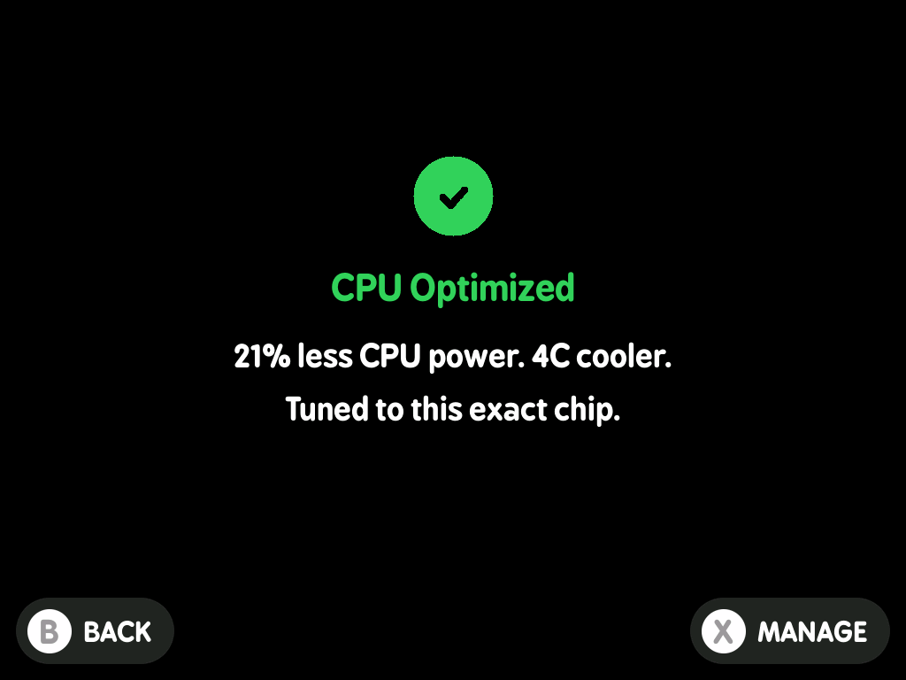
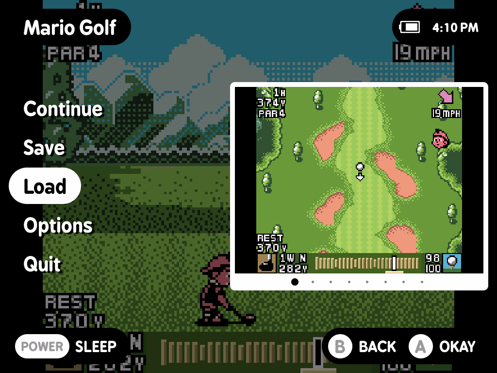

# MinUI Zero

**Same simple MinUI. Tuned end to end.**

**MinUI Zero** is a refined [MinUI](https://github.com/shauninman/MinUI) fork that keeps what makes
MinUI great (fast, simple, distraction-free gaming with almost nothing to configure) and tunes the
machine underneath so it runs cooler and lasts longer, with smoother frame pacing, cleaner audio,
lower input lag, and more dependable sleep and saves.

**Full speed. Zero tinkering.**  
Runs on the **TrimUI Brick**, **Brick Pro**, **Smart Pro**,
**Anbernic RG35XX Plus / H**, and the **Miyoo Mini family**.

  
  
  
   
  <em>Screenshots from TrimUI Brick Pro.<em>
   
   

## Why Zero

- **Longer battery**: ~7.5 hours on Game Boy, ~7 on PlayStation
- **Cooler**: 2-5°C below stock without dropping frame rate
- **No CPU settings**: every game is tuned automatically, with opt-in per-chip undervolting
- **Deep sleep by default**: near-zero draw, instant resume
- **Fast boot**: power-on to a browsable menu in seconds
- **Hard to break**: bad ROMs exit cleanly and saves are crash-safe
- **Still MinUI**: no box art, stores, accounts, or themes

## Measured (TrimUI, vs stock MinUI on the same device)

- **2-3°C cooler** than stock's default clock, **4-5°C cooler** than its 2.0GHz Performance mode
- **~7.5 hours** Game Boy battery (up from ~6 before tuning), **~6.5-7 hours** on PlayStation
- Bloody Roar II holds a **locked 60fps at stock clocks** (other firmwares reach 60 via a 2.0GHz
  overclock); Tony Hawk's Pro Skater 2 runs **60fps at 1008 MHz**, half the stock clock
- Menu idle **~26°C** with the GPU powered down

Your games, silicon, and settings vary. Raw data and reasoning:
[`docs/bench/`](docs/bench/) and [`docs/DECISIONS.md`](docs/DECISIONS.md).

## Zero or NextUI?

[NextUI](https://github.com/LoveRetro/NextUI) is the other major TrimUI MinUI fork: full-featured
and polished where Zero is deliberately minimal. Both are good firmware; pick by philosophy.

- **MinUI Zero**: ~21,500 lines / 7 MB, with a lean render path that powers the GPU down at the
  menu and never overclocks.
- **NextUI**: ~51,200 lines / 82 MB, fully GPU-based, with box art, WiFi, Bluetooth audio, cheats,
  a Pak Store, and themes.

Full comparison: [`docs/nextui-comparison.md`](docs/nextui-comparison.md).

## How it works

There is no CPU Speed setting because the machine answers that itself. Each system ships a clock
bracket measured on real hardware, and where a bracket has room the frontend holds the lowest clock
that still keeps frame rate (so Bloody Roar II pays 1800 only in the scenes that need it). The
lightest systems are pinned flat at 1008 MHz, where measurement showed nothing left to find below.
**Deep sleep** suspends to RAM, and on TrimUI **Optimize CPU** measures your chip's lowest safe
voltage for about 20% less CPU power at the same clocks. Full detail:
[**docs/how-it-works.md**](docs/how-it-works.md).

Also: stock bugs fixed (hot-running NES settings, crackling audio, hanging quit menus, LEDs
relighting themselves), NEON-accelerated PlayStation video, atomic crash-safe saves, and an opt-in
menu clock (Tools > Clock).

## Consoles

**Ready to play:** Game Boy Color, Game Boy Advance, NES, SNES, Sega Genesis, PlayStation.

**Also aboard, dormant:** Game Boy, mGBA, Super Game Boy, Game Gear, Master System, TurboGrafx-16,
Virtual Boy, PICO-8. Create the matching Roms folder (e.g. "Virtual Boy (VB)") and the system
appears, tuned core already installed.

## Install

[The latest release](https://github.com/Zero-Labs-CFW/MinUI-Zero/releases/latest) carries four
artifacts. They are not interchangeable, and a card serves the one device you installed it for.

| Device | Download | Install |
|---|---|---|
| TrimUI Brick / Brick Pro / Smart Pro | `MinUI-Zero-trimui-*.zip` | copy onto the card |
| Miyoo Mini / Plus / Flip | `MinUI-Zero-miyoo-*.zip` | copy onto the card |
| Anbernic RG35XX Plus / H | the matching `.img.xz` | flash the card |

**TrimUI and Miyoo** ride along with the stock firmware, nothing is erased: unzip the base zip onto
a blank FAT32 card, or drop `MinUI.zip` on the card root to update.

**Anbernic** *is* the operating system: write the `.img.xz` for your exact device with
[Raspberry Pi Imager](https://www.raspberrypi.com/software/), [balenaEtcher](https://etcher.balena.io/),
or `dd`. **Flashing erases the card**, and the Plus and H images are not interchangeable (each carries
its own boot chain, device tree, and kernel).

**WiFi and SSH stay off** until you ask: rename `wifi.txt.example` to `wifi.txt` at the card root with
your network as `SSID:password`, and a **WiFi Toggle** tool appears in Tools. **Minimal menu**: empty
`no-recents` and `hide-tools` files at the card root strip it further (with `hide-tools`, hold
`L1 + R1` and press `SELECT` to reach Tools anyway).

## Anbernic RG35XX Plus / H

Same launcher, governor, and cores, but newer and less proven than the TrimUI builds. Owning the
whole OS lets it boot straight to the launcher, poll input every 5ms, and idle with nothing else
running: measured **95% to 6% battery over 10.1 hours of continuous Game Boy Color** on the Plus, at
~36°C. Each device needs its own image (the H's is what makes its analog sticks work). Rough edges:
updates are a reflash (saves live on the ROMS partition), six of the fifteen systems are launch-tested,
and L3/R3 are unmapped.

## Miyoo Mini family

A real port for the SigmaStar SSD202D: same launcher and governor, eleven cores rebuilt for
ARMv7/NEON, one card for all three models (detected at boot). The **Plus** is developed and verified;
the **Mini** and **Flip** are code-complete but **never tested on real hardware**. Two caveats: none
of the measured figures above were taken on a Miyoo (the CPU is a smaller share of total power on this
SoC, so they likely do not transfer), and **deep sleep is impossible** here (the vendor kernel ships
without suspend support, so POWER blanks and idles, then quicksaves and powers off after two minutes).

## Left out

No box art, WiFi UI, store, achievements, LED effects, shaders, or themes. Anything that adds heat or
drain without earning it doesn't ship, and several flashy features were built, measured as
break-even, and cut. `docs/DECISIONS.md` records every verdict.

## Disclaimer

MinUI Zero is unofficial personal firmware, provided as-is without warranty of any kind. Custom
firmware can cause data loss, failed boots, or other device issues; back up your SD card before
installing. Use at your own risk.

## Credits

Built on [MinUI](https://github.com/shauninman/MinUI) by Shaun Inman. Deep sleep from
[zhaofengli](https://github.com/zhaofengli/MinUI); techniques from
[MyMinUI](https://github.com/Turro75/MyMinUI) and [NextUI](https://github.com/LoveRetro/NextUI); the
dynamic rate control idea from [RetroArch](https://github.com/libretro/RetroArch); the power-off
haptic cue from [SpruceOS](https://github.com/spruceUI/spruceOS); the Anbernic hardware-enablement
layer from [muOS](https://muos.dev). An independent personal fork, not affiliated with, endorsed by,
or supported by any of them. See [`LICENSE.md`](LICENSE.md) and
[`THIRD_PARTY_NOTICES.md`](THIRD_PARTY_NOTICES.md) for license, provenance, and attribution.
