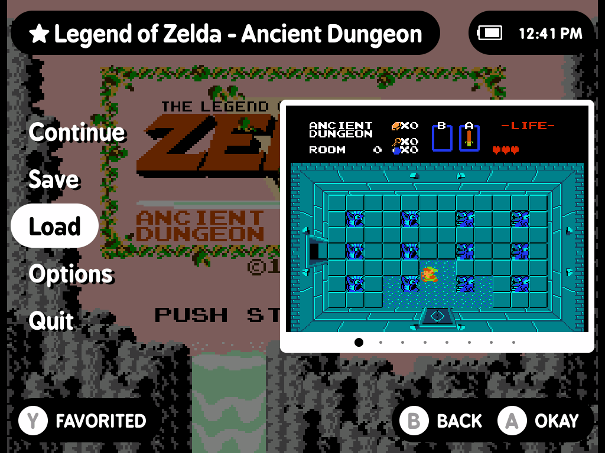
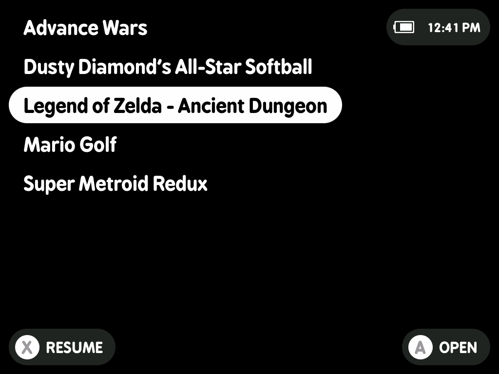

# MinUI Zero

**Same simple MinUI. Tuned end to end.**

MinUI Zero keeps what makes [MinUI](https://github.com/shauninman/MinUI) great (fast, simple, distraction-free gaming) while tuning the hardware underneath to run cooler, last longer, and stay full speed with no CPU modes and no tinkering.

**Full speed. Zero tinkering.**

Runs on the **TrimUI Brick**, **Brick Pro**, **Smart Pro**, **Anbernic RG35XX Plus / H**, and the **Miyoo Mini family**.

  
  
  
   
  <em>Screenshots from TrimUI Brick Pro.</em>
   
   

## Why Zero

Our handhelds have more power than most retro games need. Zero uses only what the game asks for.

* **Tuned per game**: the lowest clock that holds full speed (60 fps), no CPU setting to pick
* **Cooler, longer battery**: no wasted CPU or GPU work
* **Fast**: boots in seconds, games launch almost instantly
* **Instant menu**: drawn in software, so it's snappy and the GPU sleeps while you browse
* **Optimize CPU**: finds your chip's lowest safe voltage (TrimUI, opt-in)
* **Deep sleep**: near-zero draw, instant resume (TrimUI, Anbernic)
* **Smooth**: even scrolling and clean audio, even under load
* **Stock bugs fixed**: hot NES settings, crackling audio, hanging quit menus
* **Hard to break**: bad ROMs exit cleanly, saves are crash-safe
* **Device Sync**: sync saves/games directly between two handhelds, wirelessly, no WiFi network or internet needed
* **Focus mode**: a main menu of only your favorites, for a five-game handheld
* **Still MinUI**: no box art, stores, or themes

*Nothing to configure. Just play.*

[Decisions](docs/DECISIONS.md) · [NextUI Comparison](docs/nextui-comparison.md) · [Benchmarks](docs/bench/README.md)

## Consoles

**Ready to play:** Game Boy Color, Game Boy Advance, NES, SNES, Sega Genesis, PlayStation.

**Also aboard, dormant:** Game Boy, mGBA, Super Game Boy, Game Gear, Master System, TurboGrafx-16, Virtual Boy, PICO-8. Create the matching Roms folder (e.g. "Virtual Boy (VB)") and the system appears, tuned core already installed.

## Download and install

[The latest release](https://github.com/Zero-Labs-CFW/MinUI-Zero/releases/latest) carries four files. A card serves its whole family, and no card crosses families.

| Device | Download | Install |
|---|---|---|
| TrimUI Brick / Brick Pro / Smart Pro | `MinUI-Zero-trimui-*.zip` | copy onto the card |
| Miyoo Mini / Plus / Flip | `MinUI-Zero-miyoo-*.zip` | copy onto the card |
| Anbernic RG35XX Plus / H | the matching `.img.xz` | flash the card |

**TrimUI and Miyoo** ride along with the stock firmware, nothing is erased: unzip onto a blank FAT32 card, or drop `MinUI.zip` on the card root to update.

**Anbernic** *is* the operating system: flash the `.img.xz` for your exact device with Raspberry Pi Imager, balenaEtcher, or `dd`. Flashing erases the card, and the Plus and H images are not interchangeable.

## Settings

Tools > Settings is the one screen for everything you can change, drawn like the in-game Options: a value on each row and a line under the list saying what it does. Every row is also a small file, so you can set it from a computer: create the file to switch it, delete it to undo. Files at the card root work with or without a `.txt` extension.

| Row | Values | What it does | File |
|---|---|---|---|
| Recents | On / Off | Recently Played on the main menu; Off also stops recording plays | `no-recents` = Off |
| Favorites | Off / On / Focus | favorite a game with Y in its in-game menu (a star beside the title and a Favorited button show it is one); On adds Favorites to the main menu, Focus makes the main menu only your favorites | `no-favorites` = Off, `focus` = Focus |
| Tools | Shown / Hidden | SELECT + START at the main menu opens Tools even when hidden | `hide-tools` = Hidden |
| Deep Sleep | On / Off | suspend to RAM when idle (TrimUI, Anbernic); Off sleeps like stock | `.userdata/shared/disable-deep-sleep` = Off |
| Optimize CPU | Stock / Optimized | per-chip undervolting; A runs or manages it (TrimUI) | |
| WiFi | On / Off | shown once `wifi.txt` exists; on TrimUI, On also starts SSH (key only, see `authorized_keys`) | `wifi.txt` (renamed `wifi.txt.off` when Off) |
| Date & Time | | A opens the clock setter, which also owns the menu clock | `.userdata/shared/show-clock` = clock on the menu |

**Files only** (no Settings row)

| File | Effect |
|---|---|
| `wifi.txt` | one network per line as `SSID:password`; the password is yours to type |
| `timezone` | an IANA name like `America/New_York`, for the clock and DST (TrimUI) |
| `devmode` | stays awake and starts SSH; for development, costs idle battery |
| `authorized_keys` | your SSH public key; SSH accepts only this key, never a password (TrimUI keeps it in `.userdata/shared/`) |
| `.userdata/shared/enable-simple-mode` | hides Tools and replaces Options with Reset in the game menu; no escape hatch and no Settings row on purpose, for a locked-down or kid's device |

### Five Game Handheld

The [Retro Game Corps "Five Game Handheld"](https://retrogamecorps.com/2025/10/24/minui-starter-guide/#Five) ([video](https://www.youtube.com/watch?v=t2rMB5z9dQw)) idea, a handheld with just a few games on it so you actually play them, takes three settings in Zero, with no files to move:

1. Favorite your games: press Y in each game's in-game menu.
2. Tools > Settings > Favorites: **Focus**. The main menu is now only your favorites.
3. Recents: **Off** and Tools: **Hidden** for a menu with nothing else on it (SELECT + START still opens Tools).

Your whole library stays on the card. Set Favorites back to On to see it again.

**Optional box art**, like the guide's: put a PNG named after the ROM file, extension included, in a `.res` folder inside that system's folder, for example `Roms/2) Game Boy Advance (GBA)/.res/Advance Wars.gba.png`. It shows beside the list when the game is selected. Keep it about 300 px wide on TrimUI and 200 px on 480p screens (Miyoo, Anbernic).

## Device Sync

Tools > Device Sync copies saves between two handhelds over a hotspot one of them opens. No computer, internet or account, and no `wifi.txt` needed.

1. Open Device Sync on both devices and press X (Sync) on each.
2. The one you are holding lists what will copy. Press A.
3. Both copy at once and show the same progress.

* **What syncs**: saves and save states, plus Favorites and Collections (merged, so nothing added on either side is lost). Games are optional and chosen per system. Recently Played and game settings stay per device.
* **Saves follow games**: a save only goes to a device that has its game, or is getting it. Memory cards and other shared saves go where their system is.
* **Safe**: nothing is ever deleted, and anything replaced is backed up first. Backups (Y) puts back a whole sync or single files. When a save changed on both devices, the newer one wins.
* **Resumes**: an interrupted sync finishes the next time you open it, even partway through a big game.
* **Any pair**: any mix of TrimUI, Miyoo Mini Plus and Anbernic, except two Miyoo Mini Plus (it can only host). Folder names can differ between cards.

## Devices

* **TrimUI (Brick, Brick Pro, Smart Pro)**: the primary platform, where Zero is tuned and measured.
* **Anbernic RG35XX Plus / H**: Zero *is* the OS, so it boots straight to the launcher and idles with nothing else running. Newer and less proven: updates are a reflash, six of fifteen systems are launch-tested, and L3/R3 are unmapped.
* **Miyoo Mini family**: same launcher and governor, cores rebuilt for ARMv7. The Plus is verified; the Mini and Flip are untested on hardware. The tuning gains don't transfer here (the CPU is a small share of this SoC's power), and deep sleep is impossible (the vendor kernel has no suspend).

## Disclaimer

MinUI Zero is unofficial personal firmware, provided as-is without warranty. Custom firmware can cause data loss or failed boots; back up your card before installing. Use at your own risk.

## Credits

Built on [MinUI](https://github.com/shauninman/MinUI) by Shaun Inman. Deep sleep from [zhaofengli](https://github.com/zhaofengli/MinUI); techniques from [MyMinUI](https://github.com/Turro75/MyMinUI) and [NextUI](https://github.com/LoveRetro/NextUI); dynamic rate control from [RetroArch](https://github.com/libretro/RetroArch); the power-off haptic cue from [SpruceOS](https://github.com/spruceUI/spruceOS); the Anbernic hardware layer from [muOS](https://muos.dev). An independent fork, not affiliated with or endorsed by any of them. See [`LICENSE.md`](LICENSE.md) and [`THIRD_PARTY_NOTICES.md`](THIRD_PARTY_NOTICES.md).
